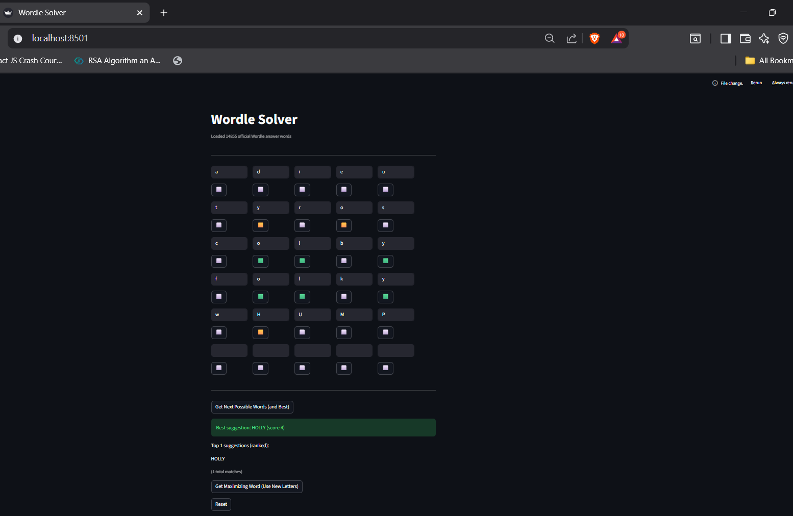

# Wordle Solver — Streamlit App

A Wordle assistant that helps you find the next best guess — built with Python and Streamlit.  
It replicates the original Wordle UI, where you can enter words, mark letters as green, yellow, or gray,  
and get intelligent word suggestions based on your feedback.

---


## Preview

Here’s how the Wordle Solver looks in action:



## Features

**Interactive Wordle-style Grid**
- Enter guesses exactly like in the real game.  
- Click color buttons to mark letters as green, yellow, or gray.  

**Smart Filtering Logic**
- Considers duplicate letters correctly.  
- Eliminates impossible words based on previous hints.  
- Suggests only valid Wordle answers.  

**Best Word Recommendation**
- Ranks all remaining words using a frequency-based scoring algorithm.  
- Highlights the single “best next word” to maximize your chances of winning.  

**Official Wordle Word List**
- Uses the original 5-letter word list from the official Wordle dataset.

**Reset Anytime**
- Quickly clear your guesses and start a new session.

---

## How It Works

The app filters and scores words based on the rules of Wordle:

1. Green letters → must appear in the same position.  
2. Yellow letters → must appear, but in a different position.  
3. Gray letters → must not appear (unless marked yellow elsewhere).  
4. The scoring algorithm counts letter frequencies across all remaining candidates,  
   favoring words with diverse and frequent letters.

---

## Tech Stack

- Python 3.9+
- Streamlit (for UI)
- Requests (for loading word list)
- Collections.Counter (for letter-frequency logic)

---

## Setup and Run

1. Clone the repository:
   ```bash
   git clone https://github.com/<your-username>/wordle-solver.git
   cd wordle-solver
Create a virtual environment (optional but recommended):

2. python -m venv venv
venv\Scripts\activate      

3. Install dependencies:

pip install streamlit requests

4. Run the app:

streamlit run wordleSolver.py
